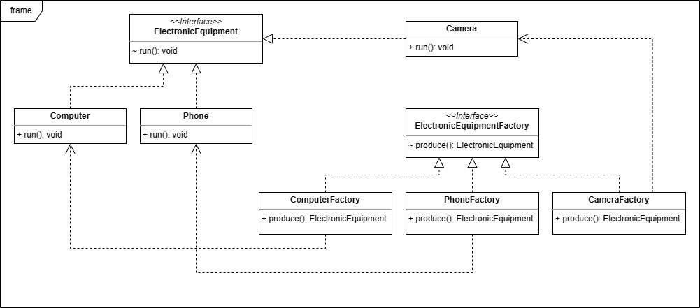

### 吴禹 2023214309
***
### 设计思路
设计一个ElectronicEquipmentFactory接口，实现这个接口来创建不同产品工厂类  
设计一个ElectronicEquipment接口，实现这个接口来定义具体产品的特定行为和属性
***
### 选用的设计模式
工厂方法模式
***
### 关键类和函数的简单说明
* 类
  * ElectronicEquipment 抽象电子产品接口
  * Computer 电脑类
  * Phone 手机类
  * Camera 数码相机类
  * ElectronicEquipmentFactory 抽象电子产品工厂接口
  * ComputerFactory 电脑工厂类
  * PhoneFactory 手机工厂类
  * CameraFactory 数码相机类
* 函数
  * run() 电子产品运行函数
  * produce() 购买或者生产电子产品函数
***
### UML图

***
### 测试用例与程序测试过程的输入输出
* 输入：
```
System.out.println("购买电脑：");
ElectronicEquipmentFactory computerFactory = new ComputerFactory();
ElectronicEquipment computer = computerFactory.produce();
computer.run();
System.out.println("-------------");
System.out.println("购买手机：");
ElectronicEquipmentFactory phoneFactory = new PhoneFactory();
ElectronicEquipment phone = phoneFactory.produce();
phone.run();
System.out.println("-------------");
System.out.println("购买相机：");
ElectronicEquipmentFactory cameraFactory = new CameraFactory();
ElectronicEquipment camera = cameraFactory.produce();
camera.run();
```
* 输出：
```
购买电脑：
Producing a computer
Computer Running.
-------------
购买手机：
Producing a phone
Phone Running.
-------------
购买相机：
Producing a camera
Camera Running.
```
  