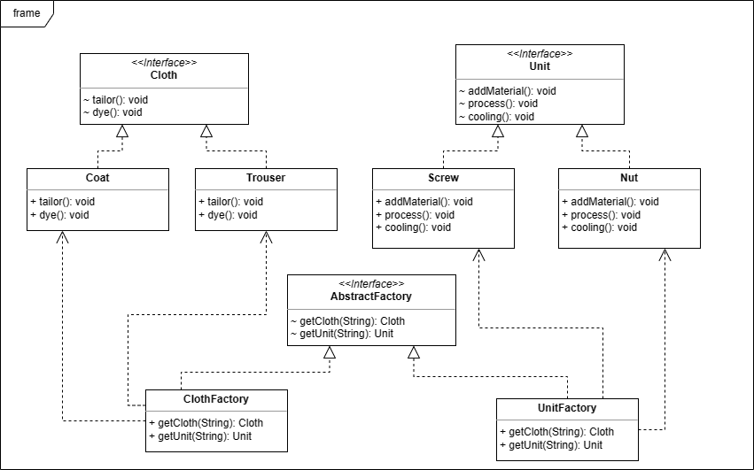

### 吴禹 2023214309
***
### 设计思路
设计一个AbstractFactory接口，实现这个接口来创建不同产品工厂类  
设计一个Cloth接口，实现这个接口来创建不同服装类  
设计一个Unit接口，实现这个接口来创建不同器件类
***
### 选用的设计模式
抽象工厂模式
***
### 关键类和函数的简单说明
* 类
  * Cloth 抽象服装接口
  * Coat 外套类
  * Trouser 裤子类
  * Unit 抽象器件接口
  * Screw 螺丝类
  * Nut 螺帽类
  * AbstractFactory 抽象工厂接口
  * ClothFactory 服装工厂类
  * UnitFactory 器件工厂类
* 函数
  * tailor 服装裁剪函数
  * dye 服装染色函数
  * addMaterial 添加原料函数
  * process 加工函数
  * cooling 冷却定型函数
  * getCloth 生产服装函数
  * getUnit 生产器件函数
***
### UML图

***
### 测试用例与程序测试过程的输入输出
* 输入：
```
AbstractFactory clothFactory = new ClothFactory();
System.out.println("生产服装-外套：");
Cloth coat = clothFactory.getCloth("coat");
coat.tailor();
coat.dye();
System.out.println("-------------");
System.out.println("生产服装-裤子：");
Cloth trouser = clothFactory.getCloth("trouser");
trouser.tailor();
trouser.dye();
System.out.println("-------------");
AbstractFactory unitFactory = new UnitFactory();
System.out.println("生产器件-螺丝：");
Unit screw = unitFactory.getUnit("screw");
screw.addMaterial();
screw.process();
screw.cooling();
System.out.println("-------------");
System.out.println("生产器件-螺帽：");
Unit nut = unitFactory.getUnit("nut");
nut.addMaterial();
nut.process();
nut.cooling();
```
* 输出：
```
生产服装-外套：
A coat tailoring.
A coat dying.
-------------
生产服装-裤子：
A trouser tailoring.
A trouser dying.
-------------
生产器件-螺丝：
Adding material of screw.
Processing a screw.
Cooling a screw.
-------------
生产器件-螺帽：
Adding material of nut.
Processing a nut.
Cooling a nut.
```