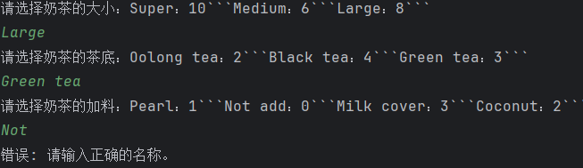

# 实验三实验报告 吴禹 2023214309

# 第一部分-策略模式

## 设计思路

设计一个Strategy接口，里面有个函数totalPrice，通过实现这个接口并重载函数totalPrice来实现不同的策略

## 选用的设计模式

策略模式

## 关键类和函数的简单说明

* Strategy 抽象的策略类接口
  * totalPrice() 计算执行策略后的总价格
* SelectMilkTeaSize 选择奶茶大小的具体策略类
* SelectMilkTeaBase 选择奶茶茶底的具体策略类
* SelectMilkTeaCharge 选择奶茶加料的具体策略类
* Context 维护一个对策略对象的引用，负责将客户端请求委派给具体的策略对象执行
  * executeStrategy() 执行策略函数
* GetThePrice 用来获取价格并修改MilkTea类的类
  * getThePrice() 根据输入获得相应的价格并且据此来修改MilkTea的成员变量
* MilkTea 一个封装好的奶茶类，里面包含各种描述奶茶属性的成员变量

## UML类图

## 测试用例

## 输入输出

* 样例1

* 样例2

# 第二部分-装饰模式

## 设计思路

设计一个抽象类MilkTeaDecorator，将MilkTea对象作为成员变量，设计decorator函数，通过继承这个抽象类MilkTeaDecorator并重载decorator函数来对MilkTea对象进行装饰

## 选用的设计模式

装饰模式

## 关键类和函数的简单说明

* MilkTeaDecorator 抽象的装饰类
  * decorator() 装饰函数
* SizeDecorator 奶茶大小装饰类
* BaseDecorator 奶茶茶底装饰类
* ChargeDecorator 奶茶加料装饰类

## UML类图

## 测试用例

## 输入输出

* 样例1

* 样例2
