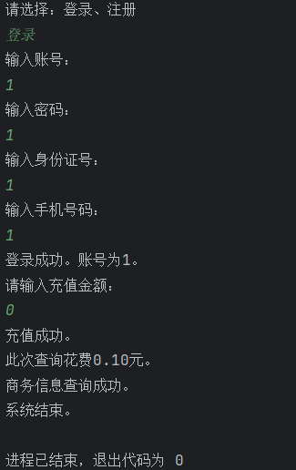

# 实验四实验报告 吴禹 2023214309

## 设计思路

设计一个User接口，定义用户的基本操作。  
随后用RealUser类继承User接口，定义用户的成员属性，简单地实现用户基本操作。  
再用一个ProxyUser类继承User接口，将RealUser类的实例作为成员变量，完整地实现用户操作。

## 设计模式

代理模式

## 关键类和函数的简单说明

* User 用户接口
  * query() 查询函数，执行查询功能
  * charge() 充值函数
  * exit() 系统退出函数
* RealUser 真实的用户类
  * account_number 账号
  * password 密码
  * ID_num 身份证号
  * phone_number 预留的手机号
  * money 账户中的储蓄
  * query_cnt 查询次数
* ProxyUser 代理的用户类
  * realUser 真实用户变量
  * user_list 读取用户文件获得的用户列表
  * sc 获得键盘输入的变量
  * identityAuthentication() 验证用户以及注册用户

## UML类图

## 测试用例

* 主函数里的调用程序

* 下图为用户存储文件，第一列是account_number，第二列password，第三列是ID_num，第四列是phone_number，第五列是money，第六列是query_cnt

## 输入输出

* 样例1（创建用户）

* 样例2（登录并查询）

* 样例3（用户金额不足）

