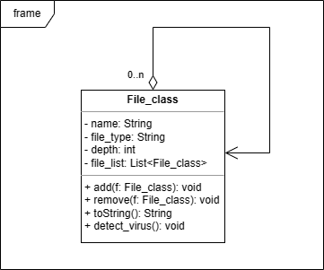
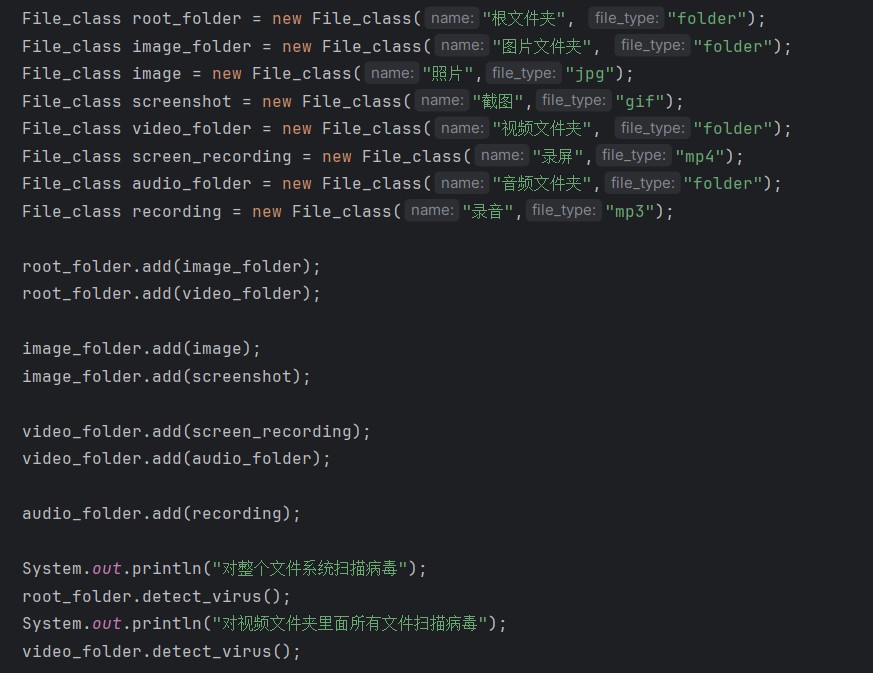
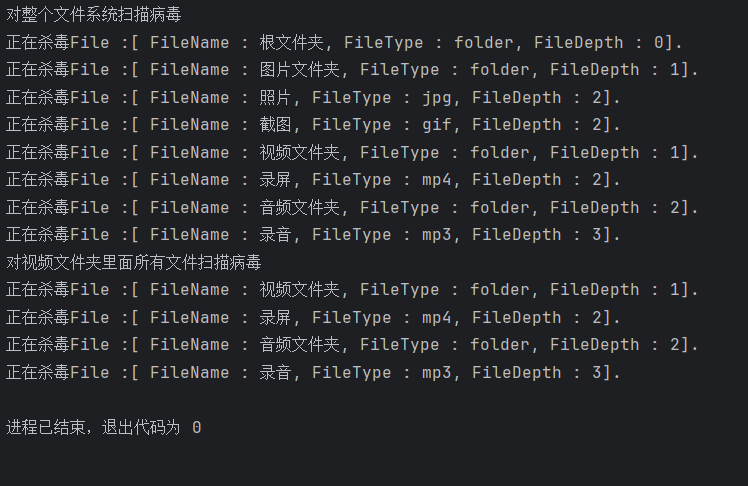
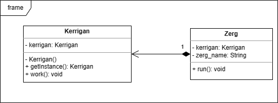
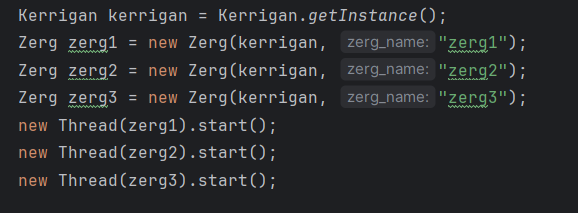
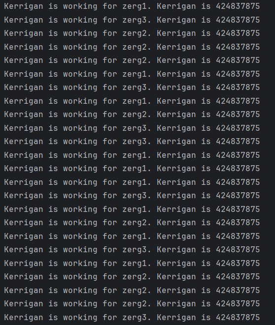
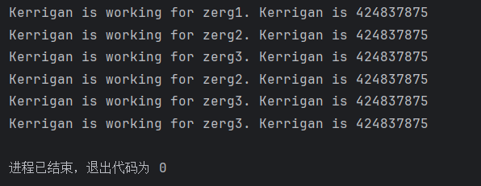

# 实验五实验报告 吴禹 2023214309

## 作业题一

### 设计思路

设计一个File_class类，可以定义所有的文件类型，将一个File_class列表作为这个类的成员变量，可以实现文件夹的效果。

### 选用的设计模式

合成模式

### 关键类和函数的简单说明

* File_class 文件类，可以表示所有类型的文件
  * name 文件名
  * file_type 文件类型
  * deep 文件所在的层次
  * file_list 如果是文件夹，则可以用该成员变量存储
  * add() 往file_list添加文件
  * remove() 从file_list中删除文件
  * toString() 打印类的信息
  * detect_virus() 可以递归地扫描文件病毒

### UML类图

### 测试用例

### 输入输出

## 作业题二

### 设计思路

设计一个Kerrigan类，限制只有一个实例，并且使用懒汉式创建实例。再设计一个Zerg类可以多线程运行，向Kerrigan实例请求服务。每个Zerg实例会向Kerrigan实例请求10次服务。

### 选用的设计模式

单例模式

### 关键类和函数的简单说明

* Zerg 虫族类
  * kerrigan 凯瑞甘实例
  * zerg_name 虫族名称
  * run() 在多线程情景下，需要执行的程序
* Kerrigan 凯瑞甘类
  * kerrigan 静态凯瑞甘实例
  * getInstance() 懒汉式获得实例函数
  * work() 服务函数

### UML类图

### 测试用例

### 输入输出

