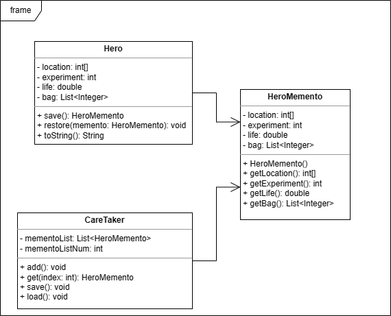
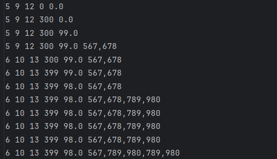
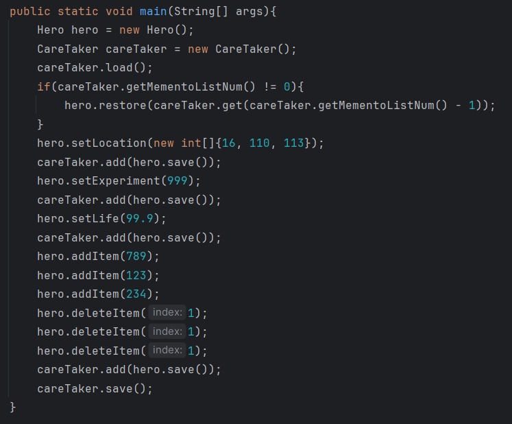
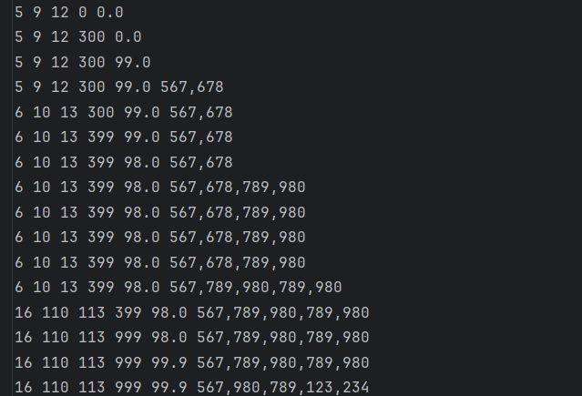
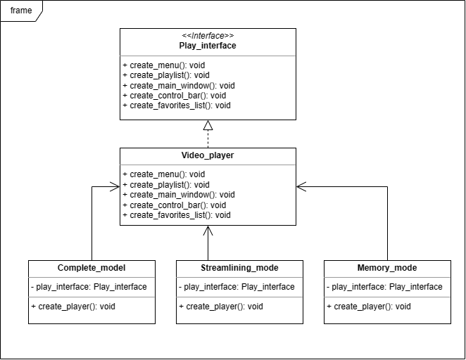
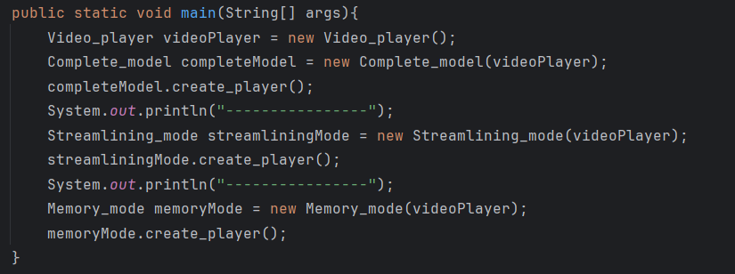
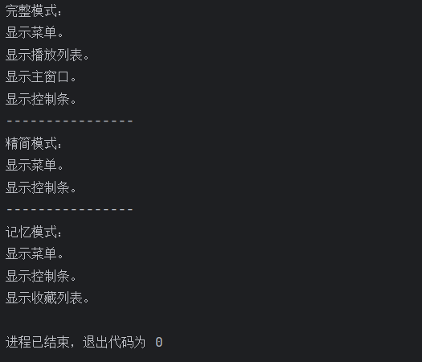

# 实验六实验报告 吴禹 2023214309

## 作业题一

### 设计思路

根据题目的要求首先设计Hero类，类里面成员变量定义游戏主角需要的属性值。随后设计HeroMemento类用来存储某个时刻游戏主角的状态。最后设计CareTaker类将多个HeroMemento实例存储到本地，或者从本地读取存储的数据。

### 选用的设计模式

备忘录模式

### 关键类和函数的简单说明

* Hero 游戏主角类
  * location 位置信息
  * experiment 经验值
  * life 生命值
  * bag 背包
  * deleteItem() 删除背包的物品
  * addItem() 添加物品
  * save() 将当前的状态存储到HeroMemento类中
  * restore() 从HeroMemento实例中读取状态
  * toString() 将角色信息以字符串表示出来
* HeroMemento 存储角色某个时刻状态类
* CareTaker 存储所有记录的状态
  * mementoList 状态列表
  * mementoListNum 存储的状态数目
  * add() 添加状态
  * get() 根据下表获取状态
  * save() 将所有暂存的状态存储到本地文件里
  * load() 从本地文件读取存储的状态

### UML类图

### 测试用例

程序执行前的本地文件内容，前三列是位置信息，第四列是经验值，第五列是生命值，后续所有列都是物品信息，用“，”分隔开。

### 输入输出

程序执行后的本地文件信息如下：

## 作业题二

### 设计思路

设计一个Play_interface接口，里面定义视频播放器需要的组成元素。通过Video_player类实现Play_interface接口，实现组成元素具体的实现方式。最后根据三种模式具体需要的组成元素，设计三个类分别实现具体的要求。

### 选用的设计模式

建造者模式

### 关键类和函数的简单说明

* Play_interface 抽象组成元素的接口
  * create_menu() 菜单
  * create_playlist() 播放列表
  * create_main_window() 主窗口
  * create_control_bar() 控制条
  * create_favorites_list() 收藏列表
* Video_player 实现接口定义的组成元素具体创建方法的类
* Complete_model 实现具体模式的类
* Streamlining_mode 实现精简模式的类
* Memory_mode 实现记忆模式的类

### UML类图

### 测试用例

### 输入输出

