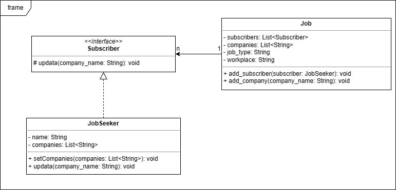
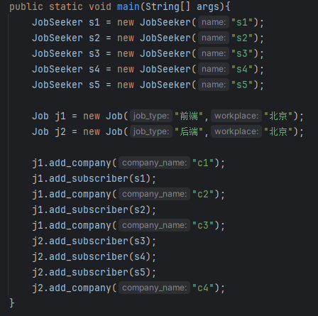
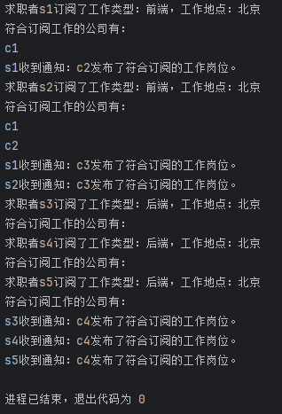
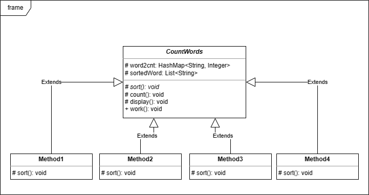
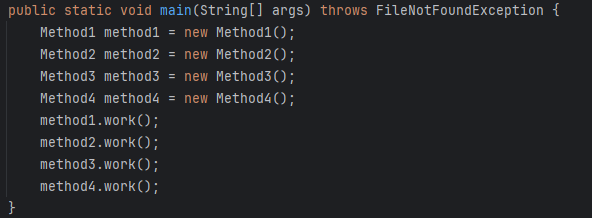
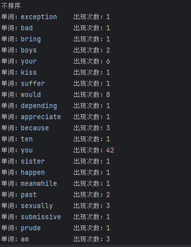
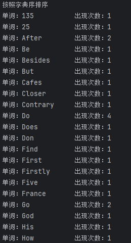
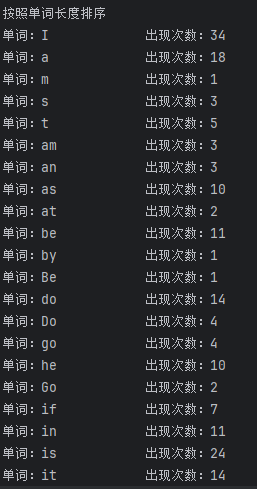
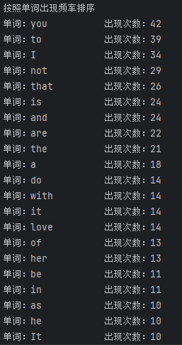

# 实验七实验报告 吴禹 2023214309

## 作业题一

### 设计思路

设计一个Job类作为具体主题类，里面成员变量定义了工作类型和地点，并且分别用一个列表存储订阅者和提供这种工作的公司，每次有新的公司会通知所有订阅这类工作的求职者。定义一个Subscriber接口，相当于抽象观察者，里面含有一个update函数用于信息更新。定义一个JobSeeker类实现Subscriber接口，相当于具体观察者。

### 选用的设计模式

观察者模式

### 关键类和函数的简单说明

* Subscriber 抽象观察者
  * update() 信息更新抽象方法
* JobSeeker 具体观察者
  * name 求职者名称
  * companies 符合工作要求的公司
  * setCompanies() 从参数复制公司信息过来
  * update() 具体的信息更新实现
* Job 具体主题类
  * subscribers 订阅该类工作的求职者
  * companies 提供该类工作的公司
  * job_type 工作类型
  * workplace 工作地点
  * add_subscriber() 添加订阅者
  * add_company() 添加公司

### UML类图

### 测试用例

### 输入输出

## 作业题二

### 设计思路

定义一个抽象类CountWords，里面定义了统计并展示词频的三个函数count、sort和display，并且已经实现了count和display，后续通过继承这个抽象类来具体实现sort函数以达到不同的排序效果。

### 选用的设计模式

模板模式

### 关键类和函数的简单说明

* CountWords 抽象模板角色
  * word2cnt 用于存储出现的单词以及对应出现次数
  * sortedWord 根据某个规则排好序的单词列表
  * sort() 抽象方法，需要根据具体的排序规则去实现
  * count() 读取文件并且统计词频
  * display() 展示排序后的列表
  * work() 将count、sort和display作为一个整体向外展示
* Method1 不排序
* Method2 按照字典序排序
* Method3 按照单词长度排序
* Method4 按照单词出现频率排序

### UML类图

### 测试用例

### 输入输出

* 不排序的部分结果

* 按照字典序排序的部分结果

* 按照单词长度排序的部分结果

* 按照单词出现频率排序的部分结果

